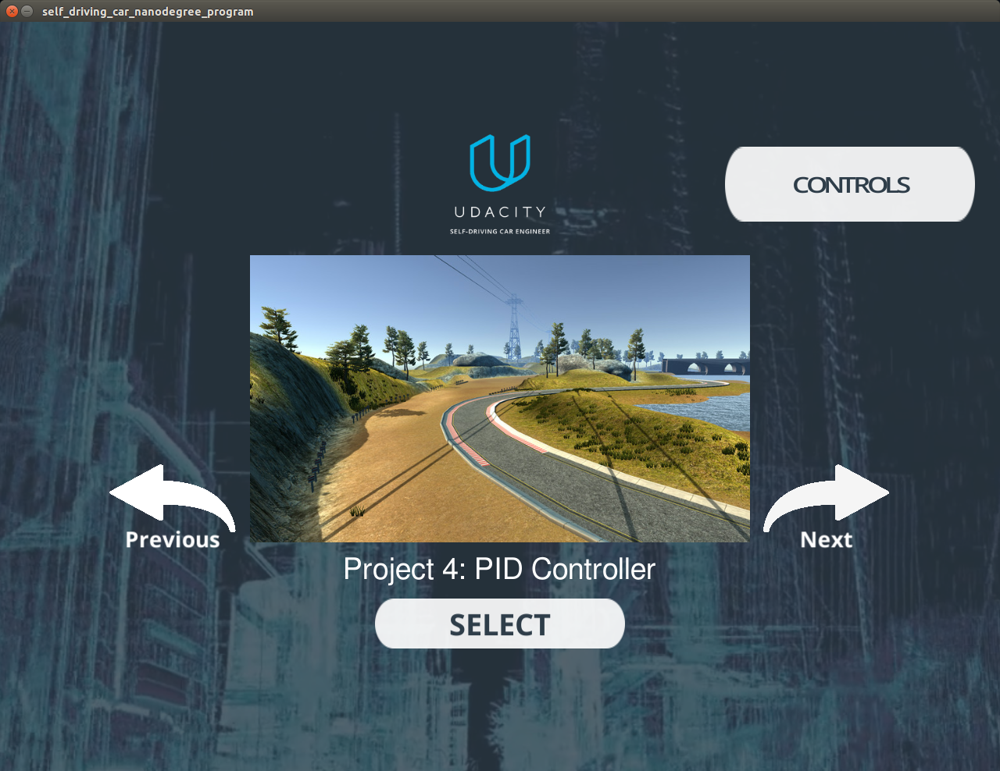

# PIDControlSDCN
PID controller implementation for Udacity Self Driving Car Nanodegree

### Overview
This repository contains implementation of a PID control to steer the car driving on the race track in the Udacity simulator. Essentially, the simulator sends to the PID controller the speed and the steering angle of the vehicle, as well as the value for the cross track error (CTE), i.e. the distance of the car from the center of the track (ideal path). The PID controller processes the data from the simulator, and calculates the desired steering value and the throttle value, which are then sent back to the simulator and used to drive the vehicle. 
The goal of the project is to find the right parameters of the PID controller, so that the vehicle drives around the track successfully, relatively fast and safe, and as close as possible to what humans would consider a comfortable and a safe ride. 

### C++ source files
We have the following C++ source files in the _src_ directory of the repository:

- json.hpp - This file contains all the JSON definitions we need for the project (and more), since JSON is the format used for passing information between our program and the Udacity simulator. 
- main.cpp - This is the main file of the program, which contains the main function. More details on the program flow and the algorithm is given below.  
- PID.cpp and PID.h - These files contain all the implementation code of the PID controller filter. More details on the content is given below. 

### The source files _main.cpp_ and _PID.cpp_

The source files _main.cpp_ and _PID.cpp_ contain the main functions of the program, namely the main function (main.cpp) and all of the steps in the PID controller implementation.

- The main function in main.cpp is relatively simple. The important piece to understand how the simulator and the PID controller work together is inside the callback function _onMessage(...)_. With every message, the main program receives the values from the simulator for speed, steering value and CTE. Based on CTE, the PID controller updates the state of the PID controller, namely the proportional, integral and differential errors. This is done in the function _UpdateError(...)_ of the controller. Subsequently, we use the PID controller functions _TotalError()_ and _CalculateThrottle()_ to calculate the values for steering and throttle, respectively. These values are packaged into a JSON message, and sent back to the simulator. The simulator uses these values and sends back the updated values for speed, angle and CTE, and the loop repeats. 
- ParticleFilter::init - this function is called when the first message from the simulator is received by the program. The function initializes the position x, y and theta and their uncertainties to the GPS data. The desired number of particles (e.g. 150) is created and their position initialized to the Gaussian distribution around the initial x, y and theta values of the vehicle. 
- ParticleFilter::prediction - this function predicts the next position of each particle based on the control data. The position is updated by updating x, y and theta based on the velocity and the yaw rate. We add noise to each of the position params separately. If the yaw rate is very small, we assume that theta is constant and only x and y are updated. 
- ParticleFilter::updateWeights - this function updates the weights for each particle based on the multi variate Gaussian distribution. Firstly, for each particle we collect the landmarks within the sensor range of the particle, and then transform the detected landmarks from the map coordinates to the vehicle coordinates. Then we perform data association for the particles, so that we assign the landmark ID from the map to each detected observation by using the nearest neighbor method. Finally, using the multi variate Gaussian we update the weights of the particles by multiplying weights associated with each individual observations. 
- ParticleFilter::resample - this functions resamples the collection of the particles, so that the probability that the particle will "survive" (i.e. be sampled) is proportional to the newly calculated weight of the particle. This is done by using the so-called resampling wheel method, as described in the lecture. At the end of this step we have the same number of particles as before, but some of the original particles have not survived, while some may have been sampled multiple times. 
- After reporting the accuracy and the average/max weight of the particles, the program repeats prediction/updateWeights/resample steps using the new (resampled) collection of particles. 

### Output from the program
The output of the program is monitored in the simulator screen. The screen shows the system time since the simulation has started, the number of time steps, and the error for the state variables x, y and yaw. The goal of the project is that the simulator run finishes within 100 seconds, and if it does and the errors are within the predefined range, the final screenshot from the run will look like the image below.  


 
 If the simulation runs out of time (for example because of too many particles used, which slows down the run), the message "You ran out of time" will appear on the screen after 100 seconds elapsed since the begining of the run. 
 
### How to run the program
After cloning this repository, simply execute the following commands to build and run the program:
```
./clean.sh
./build.sh
./run.sh
```
At the same time, the Udacity simulator needs to be running, so that the simulator and the UKF program connect and exchange information. 

### Setting up the environment 
- The project is configured to compile with cmake and make. Please make sure that the following dependencies are met:
   - cmake version 3.5
   - make version 4.1 for Linux and Mac and 3.81 for Windows
   - gcc/g++ version 5.4
- Download the Udacity simulator from [here](https://github.com/udacity/self-driving-car-sim/releases/)
- Additional libraries need to be installed by running:
   - On Ubuntu, install-ubuntu.sh 
   - On Mac, install-mac.sh
   - On Windows, the recommended way is to run a virtual machine and use the install-ubuntu.sh script
   
### More information
For even more information on the project structure, dependencies etc. please check original Udacity project [repository](https://github.com/udacity/CarND-Kidnapped-Vehicle-Project)
